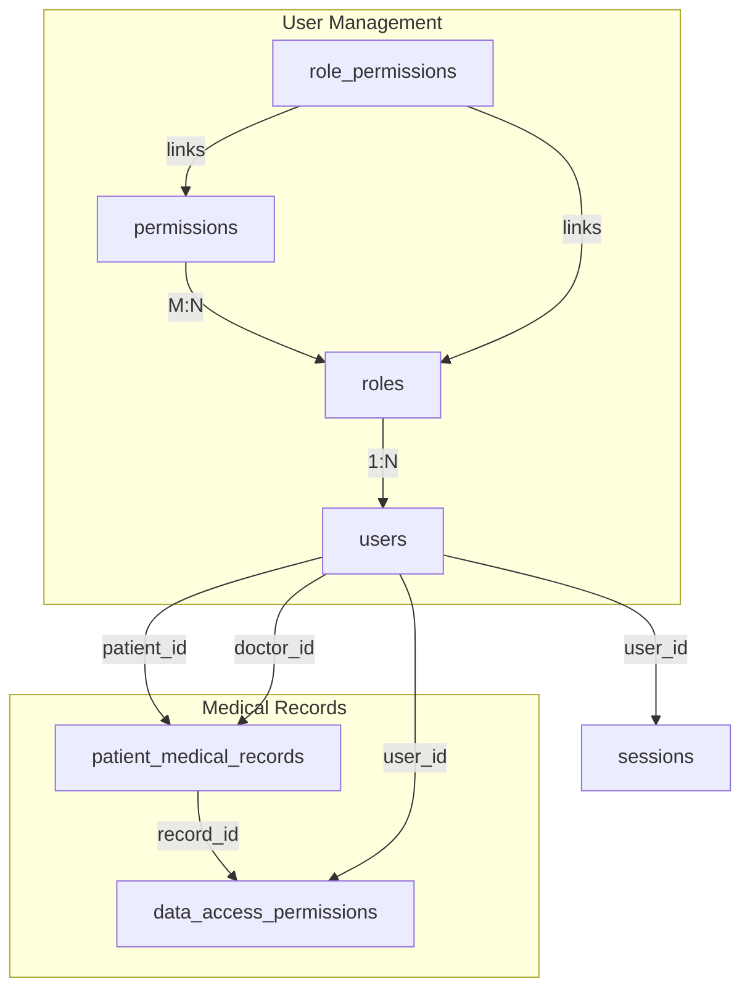

| Role           | Key Permissions                                               |
| -------------- | ------------------------------------------------------------- |
| System Admin   | All permissions                                               |
| Doctor         | Medical records, lab results, prescriptions, patient history  |
| Nurse          | View medical records                                          |
| Lab Technician | View medical records, add/view lab results                    |
| Patient        | View own medical records (and optionally lab & prescriptions) |


# Healthcare EMR Database Structure & Flow Guide

## **Project Overview**
This is a **Role-Based Electronic Medical Records (EMR) System** with granular permission controls. The database is designed for a multi-user healthcare environment where different roles have specific access rights to medical records.

---

## **Core Tables & Relationships**

### 1. **User Management System**

#### **`roles` Table**
- Defines user roles in the system
- **Default roles**: System Admin, Doctor, Nurse, Lab Technician, Patient
- **Custom roles**: Can be created dynamically (e.g., manager, security, testing roles)
- **Key fields**: `id`, `name`, `slug`

#### **`permissions` Table**
- Contains all possible actions in the system
- **21 predefined permissions** including:
  - View/Edit/Create/Delete Medical Records
  - View/Add/Edit/Delete Lab Results
  - Manage Users & Permissions
  - Export Data & View Analytics
- **Key fields**: `id`, `name`, `slug`

#### **`role_permissions` Table**
- **Junction table** linking roles to permissions
- Defines what each role can do
- **Example**: Doctor role has permissions: view, edit, create medical records, view lab results, etc.

#### **`users` Table**
- Stores all system users (patients and healthcare providers)
- **Role-based**: Each user is linked to a role via `role_id`
- **Patient-specific fields**: `date_of_birth`, `gender`, `blood_group`, `address`
- **Foreign Key**: `role_id` → `roles(id)`

---

### 2. **Medical Records System**

#### **`patient_medical_records` Table**
- **Core medical data storage**
- **Key relationships**:
  - `patient_id` → `users(id)` (Patient who owns the record)
  - `doctor_id` → `users(id)` (Doctor who created/updated the record)
- **Medical data fields**:
  - `medical_history`, `diagnosis`, `prescription`, `lab_results`
  - Vital signs: `blood_pressure`, `temperature`, `pulse_rate`, `weight`, `height`
  - `allergies`, `notes`
- **Visibility control**: `visibility_level` (private/restricted/public)

#### **`data_access_permissions` Table**
- **Fine-grained access control** for individual records
- Allows sharing specific records with specific users
- **Fields**: `record_id`, `user_id`, `can_view`, `can_edit`
- **Foreign Keys**: 
  - `record_id` → `patient_medical_records(id)`
  - `user_id` → `users(id)`

---

### 3. **Supporting Tables**

#### **`cache` & `sessions` Tables**
- Laravel framework tables for session management and caching
- Track logged-in users and their permissions

#### **`failed_jobs`, `password_reset_tokens`, `personal_access_tokens`**
- Laravel system tables for job management, password resets, and API tokens

---

## **Database Flow & Relationships**



---

## **Key Business Logic Flows**

### **1. User Authentication & Role Assignment**
```
User Registers/Logs In → Assigned Role → Role Permissions Loaded → Session Created
```

### **2. Medical Record Creation**
```
Doctor creates record → Record linked to Patient & Doctor → 
Visibility level set → Optional: Grant specific access via data_access_permissions
```

### **3. Record Access Control**
**Three-tier access model:**
1. **Role-based permissions** (What can this role do generally?)
2. **Record visibility level** (private/restricted/public)
3. **Individual data access permissions** (Can User X view/edit Record Y?)

### **4. Permission Hierarchy**
```
System Admin: Full access (all permissions)
Doctor: Create/edit own patients' records, view lab results
Nurse: View/edit records, view lab results
Lab Technician: Add/edit lab results
Patient: View own records/lab results/prescriptions
Custom Roles: Configurable permissions
```

---

## **Data Relationships in Practice**

### **User to Medical Records:**
- **Patient**: Can view their own records (via `patient_id` relationship)
- **Doctor**: Can view/edit records they created (via `doctor_id` relationship)
- **Other roles**: Access based on permissions + data_access_permissions

### **Example Query: Get all records a doctor can access**
```sql
-- Records doctor created
SELECT * FROM patient_medical_records WHERE doctor_id = {doctor_id}
UNION
-- Records shared with doctor via data_access_permissions
SELECT pmr.* FROM patient_medical_records pmr
JOIN data_access_permissions dap ON pmr.id = dap.record_id
WHERE dap.user_id = {doctor_id} AND dap.can_view = 1
UNION
-- Public records
SELECT * FROM patient_medical_records WHERE visibility_level = 'public'
```

---

## **Security Features**

### **1. Multi-layered Access Control**
- Role-based permissions at application level
- Database-level foreign key constraints
- Individual record sharing capabilities

### **2. Data Integrity**
- **Cascade deletes**: Delete user → delete their medical records
- **Set null on delete**: Delete doctor → keep records, set `doctor_id` to NULL
- **Unique constraints**: Prevent duplicate permissions/access grants

### **3. Audit Trail**
- `created_at` and `updated_at` on all tables
- Doctor attribution on medical records
- Session tracking

---

## **Current Data State (From Dump)**

### **Users by Role:**
- **System Admin (1)**: admin@emr.com
- **Doctors (4)**: Includes Dr. John Smith, rambiraj, muskan
- **Nurses (2)**: Nurse Jane Williams, neha
- **Lab Technicians (2)**: Lab Tech Mike Brown, vishal
- **Patients (7)**: Includes test patients with medical records
- **Custom Roles (5)**: manager, teacher, dummy-testing, testing, security

### **Medical Records:**
- **7 records** created for various patients
- **Visibility**: All currently set to 'public'
- **Sample data**: Contains medical history, vitals, lab results, prescriptions

### **Data Sharing Examples:**
- Record ID 2 shared with user ID 7 (muskan - doctor) for view-only access
- Record ID 2 shared with user ID 4 (lab@emr.com) for view-only access

---

## **Recommendations for Senior Explanation**

### **Highlight These Key Points:**
1. **Scalable Role System**: New roles can be created without code changes
2. **Fine-grained Permissions**: Three levels of access control
3. **Data Relationships**: Clear separation between patients, providers, and records
4. **Security**: Built-in data protection at multiple levels
5. **Flexibility**: Can accommodate various healthcare workflows

### **Visual Aids to Create:**
1. **Role-Permission Matrix**: Show what each role can do
2. **Data Flow Diagram**: How records move through the system
3. **Access Control Flowchart**: Decision tree for "Can user X access record Y?"

### **Real-world Scenarios to Demo:**
1. Doctor creating and sharing a record
2. Patient viewing their own medical history
3. Lab technician adding results to a shared record
4. Admin creating a custom role for a department head

This database structure provides a robust foundation for a healthcare EMR system with strong security controls and flexible permission management.